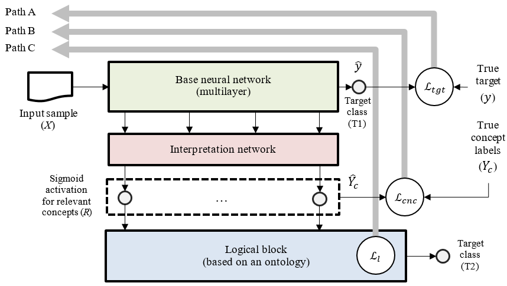

<p align="center">
<b><ins>Exp</ins>laining via <ins>O</ins>ntology-based <ins>S</ins>elf-<ins>E</ins>xplainable <ins>N</ins>eural <ins>N</ins>etworks</b>
</p>

[](https://opensource.org/licenses/BSD-3-Clause)

<b>ExposeNN</b> is a library for constructing ontology-aware self-explainable neural networks. It is designed to be extensible and supports several 
explainable architectures as well as several training methods. Main features of the library are:

* building an explainable ontology-aware architecture using given OWL 2 ontology and given backbone neural model (PyTorch);
* training of an explainable ontology-aware architecture (in a fully supervised or semi-supervised way);
* making inference using an explainable ontology-aware architecture, obtaining the target prediction as well as ontology concepts, relevant 
  to the sample being processed.

The approach underlying the ExposeNN library was proposed in the following paper:

* A. Smirnov, A. Ponomarev, and A. Agafonov, “Ontology-Based Neuro-Symbolic AI: Effects on Prediction Quality and Explainability,” IEEE Access, 2024, doi: [10.1109/ACCESS.2024.3485185](https://doi.org/10.1109/ACCESS.2024.3485185).
## How the library works
The core of the approach is a generalized framework for constructing explainable neural networks using the ontology of the problem domain. This framework combines features of post-hoc approaches to explanation and self-explainable architectures. Based on this framework, specific self-explainable architectures of neural networks and methods for their training can be created, taking into account the characteristics of the problem, the amount of available data, and the structure of the problem domain ontology.

The explainable neural network includes three blocks: 
* **Base neural network** (consisting of several layers, i.e. belonging to the class of deep neural networks). The base network takes an input sample and solves the problem by classifying this sample (for example, assigning it or not assigning it to a given class, if it is a binary classification problem).
* **Interpretation network**. The interpretation network receives activations of some intermediate layers of the base network, and its outputs correspond to concepts of the problem domain ontology relevant to the sample processed by the base network. The goal of the interpretation network is to establish connections between the internal representations of the processed sample built by the base neural network and human-understandable ontology concepts. The interpretation network is trainable, and its training requires samples, labeled for all ontology concepts that should be placed during explanation.
* **Logical block**. The logical block takes into account the relationships between ontology concepts (for example, the incompatibility of two concepts, subclass relation, and others). These logical relationships are not learnable but are represented in a differentiable form so that they can be used in the training process of both base and interpretation networks. One of the outputs of the logical block is the target class label (T2). The logical block can be implemented using one of the existing knowledge integration methods.

<p align="center">
  
</p>

## ExposeNN Techniques
### Training Approaches
The library implements two types of mapping networks whose parameters can be flexibly customized by the user.

| Approach                                         | Description                                                                                                                               |
|--------------------------------------------------|-------------------------------------------------------------------------------------------------------------------------------------------|
| Training without integrating logical constraints | Assumes the use of a classic loss function, such as binary cross-entropy, which does not leverage ontology knowledge to enhance training. |
| Training with integrated logical constraints     | It is implemented through one of the symbolic knowledge integration methods, such as the use of a semantic loss function.                 |

### Training Implementation Methods

| Method                | Description                                                                                    | Training Steps                                                                                                                                                    |
|-----------------------|------------------------------------------------------------------------------------------------|-------------------------------------------------------------------------------------------------------------------------------------------------------------------|
| Single-cycle training | Training is conducted using a single complex loss function that considers multiple components. | One step with a unified loss function.                                                                                                                            |
| Multi-stage training  | Training is divided into multiple stages, each using a different loss function.                | 1. Train on data labeled only for the target class with a classical loss function.<br/>2. Continue training on data with concept labels and semantic constraints. |


## How to Use
Here are the main steps for building and training a self-explainable architecture using ExposeNN:

1. To create a self-explainable architecture, it is necessary to load the ontology and determine which of the concepts relevant to the target should appear in the explanations. These concepts must match those represented in the data annotations to enable the model to be trained with known labels.
    ```
    import exposenn.ontology

    ontology = exposenn.ontology.MockOntologyAnalyzer('ontologies/demo.rdf')
    target_concept = ontology.get_concept('Class1')
    relevant_concepts = ontology.get_relevant('Class1')
    ```
   
2. Next, it is necessary to establish a correspondence between the column names in the annotations and the ontology concepts to link each data element to a specific semantic meaning. Then, retain only the concepts that will be included in the architecture.
    ```
    import pandas as pd

    df = pd.read_csv('data/demo_extended.csv')
   
    column_to_concept = {
        'A': ontology.get_concept('A'),
        'B': ontology.get_concept('B'),
        'AorB': ontology.get_concept('AorB'),
        'classC': ontology.get_concept('C'),
        'tgt': ontology.get_concept('Class1')
    }
   
    concepts = [x for x in relevant_concepts if x in column_to_concept.values()]
    ```

3. Define the architecture of the base neural network (backbone). Since this example considers the task of binary classification, the network will have 1 output neuron.
    ```
    import torchvision
    import torch.nn as nn
   
    backbone = torchvision.models.resnet18()
    backbone.fc = nn.Linear(512, 1)
    ```

4. The interpretation network can be connected to various layers of the base network. The configuration of these connections is described using a set of pairs (layer - connector), where the layer refers to a specific layer of the base network, and the connector is a special module (``nn.Module``) that takes the output of this layer as input and produces a one-dimensional tensor to be passed to the interpretation network.<br/> The function ``create_connectors()`` has been developed to initialize the connectors and calculate the features of the selected layers of the base network.
    ```
    import exposenn.models
    from exposenn.utils import create_connectors

    connectors, total_features = create_connectors(backbone, [nn.Conv2d, nn.BatchNorm2d])

    model = exposenn.models.MLPInterpretationNetwork(
        backbone,
        connectors,
        [total_features, len(concepts)]  
    )
    ```

5. Once the architecture of the self-explainable network is defined, it is necessary to load the data and define the dataloaders that will be used during training.
    ```
    import torch
    import exposenn.data

    # reverse mapping of concepts into columns of the dataset
    concept_to_column = {
        concept: column
        for column, concept in column_to_concept.items()
            if concept in concepts
    }
   
    concept_columns = list(concept_to_column.values())
   
    dataset = exposenn.data.AnnotatedImagesDataset('data/demo_extended.csv', # annotation file
                                                   'data/img/', # image directory
                                                   'img', # filename column  
                                                   'tgt', # target column        
                                                    concept_columns, # concept column list
                                                    transform=torchvision.transforms.ToTensor())
    dataloader = torch.utils.data.DataLoader(dataset, batch_size=2)
    ```
   
6. The ``get_relevant_statements()`` function extracts logical statements (in the form of implications) between concepts based on relationships within the ontology. These logical statements are then used to initialize the semantic loss function.<br/>The ``AdditiveMultipartLoss`` class allows the definition of a combined loss function that integrates the target loss function (typically cross-entropy) with the concept loss function (e.g., semantic loss).<br/>The ``train`` method is used to train the constructed self-explainable neural network.
    ```
    import exposenn.trainers
    from exposenn.loss import SemanticLoss, AdditiveMultipartLoss

    statements = ontology.get_relevant_statements(relevant_concepts + [target_concept])
    semantic_loss = SemanticLoss(list(concept_to_column.keys()), statements)
   
    optim = torch.optim.Adam(model.parameters())
    loss_fn = AdditiveMultipartLoss(
        concepts_loss_fn = semantic_loss_with_tgt,
        target_loss_fn = torch.nn.BCEWithLogitsLoss()
    )
    history = exposenn.trainers.train(model, dataloader, loss_fn, optim, max_epochs=5)
    ```

## Installation

You can view a list of required dependencies in the [requirements.txt](https://github.com/cais-lab/exposenn/blob/main/requirements.txt) file. You can also install them as follows:

```bash
git clone https://github.com/cais-lab/exposenn.git
cd exposenn
python3 -m venv venv
source venv/bin/activate
pip install -r requirements.txt
```

## Project Structure

The repository includes the following directories:

* Package `data` contains an example of the dataset and its annotation;
* Package `ontologies` contains examples of ontology files in OWL format.

## Project Team

* [Andrew Ponomarev](https://github.com/a-v-ponomarev)
* [Anton Agafonov](https://github.com/aaagafonov)
* [Nikolay Shilov](https://github.com/NikolayShilov)


## Funding
The ExposeNN library was developed in the scope of the project 22-11-00214, funded by the Russian Science Foundation (RSF).


